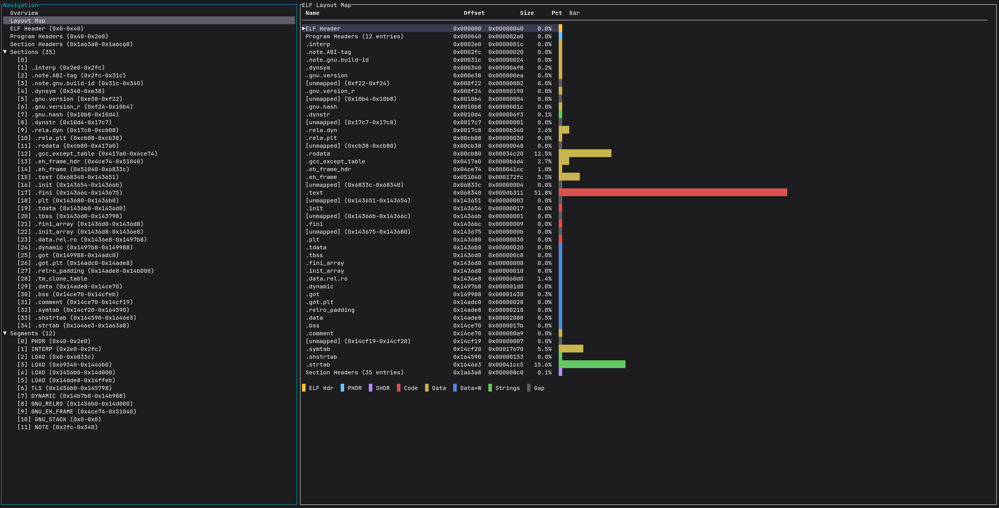

# ELF Insight

[English](#english) | [中文](#chinese)

一个基于 Rust + Ratatui 的终端 ELF 文件查看器，vi/less 风格操作，支持 hexdump、反汇编、字符串、动态链接条目等解析。

[](screenshot.png)

---

## <a name="chinese"></a>中文

### 功能

- **Overview** — 类似 `readelf -WSlh` 的 ELF 结构全景视图
- **Layout Map** — 竖排表格展示文件布局，颜色区分 ELF Header / PHDR / SHDR / Code / Data / 未映射区域，支持 Enter 跳转
- **Hexdump** — 十六进制 + ASCII 双栏，光标移动高亮，支持搜索
- **反汇编** — 函数列表 + 指令反汇编，左右面板切换，光标高亮
- **Strings** — 从 section 中提取可打印字符串
- **Dynamic** — 解析 `.dynamic` section 的动态链接条目
- **搜索** — `/` 搜索，结果高亮，`n`/`N` 跳转，`Esc` 清除
- **视图切换** — `m` 键在 Hexdump / Disassembly / Strings / Dynamic 之间切换

### 安装

```bash
git clone https://github.com/kyrie-z/elf-insight.git
cd elf-insight
cargo build --release
./target/release/elf-insight <elf-file>
```

### 快捷键

| 快捷键 | 功能 |
|--------|------|
| `j` / `k` / `↑↓` | 行滚动 |
| `gg` / `G` | 跳转顶部 / 底部 |
| `u` / `d` | 半页上 / 下 |
| `PgUp` / `PgDn` | 整页上 / 下 |
| `Home` / `End` | 跳转顶部 / 底部 |
| `Tab` | 切换树 ↔ 详情面板 |
| `h` / `←` | 折叠节点 (树) / 左移光标 (hex) |
| `l` / `→` / `Enter` | 展开节点 (树) / 右移光标 (hex) |
| `m` | 切换 section 视图模式 |
| `Esc` | 清除搜索 → 回退焦点 → 回退跳转 |
| `/` | 打开搜索栏 |
| `n` / `N` | 下一个 / 上一个匹配 |
| `?` / `H` | 帮助面板 |
| `q` | 退出 |

### 架构

```
src/
├── main.rs           # 入口，CLI 参数解析
├── app.rs            # App 状态机、事件分发、视图路由
├── elf/
│   ├── parser.rs     # goblin 封装，ElfData 内部结构
│   └── disasm.rs     # iced-x86 封装，DisasmResult + 函数识别
└── ui/
    ├── mod.rs        # 主布局渲染 (左右分栏)
    ├── tree.rs       # 左侧导航树
    ├── overview.rs   # Overview 视图 (readelf 风格)
    ├── layout_map.rs # ELF 布局映射视图
    ├── info.rs       # 结构化信息视图 (字段表格)
    ├── hexdump.rs    # Hexdump 视图 (光标高亮)
    ├── disasm.rs     # 反汇编视图 (函数列表 + 指令)
    ├── strings.rs    # 字符串提取视图
    ├── search.rs     # 搜索栏 + 搜索逻辑
    └── help.rs       # 帮助面板
```

### 依赖

| Crate | 用途 |
|-------|------|
| `ratatui` 0.29 | TUI 框架 |
| `crossterm` 0.28 | 终端后端 |
| `goblin` 0.9 | ELF 解析 |
| `iced-x86` 1.21 | x86-64 反汇编 |

### 开发

```bash
cargo run -- /bin/ls        # 运行
cargo test                  # 运行测试
cargo build --release       # 发布构建
```

## <a name="english"></a>English

### Features

- **Overview** — ELF structure summary like `readelf -WSlh`
- **Layout Map** — Vertical table with colored bars showing file layout (ELF Header / PHDR / SHDR / Code / Data / unmapped regions), Enter to jump
- **Hexdump** — Hex + ASCII dual-column view with cursor highlight and search
- **Disassembly** — Function list + instruction disassembly, split-panel with cursor highlight
- **Strings** — Extract printable strings from sections
- **Dynamic** — Parse `.dynamic` section entries
- **Search** — `/` search with highlight, `n`/`N` navigation, `Esc` to clear
- **View switching** — `m` key to cycle between Hexdump / Disassembly / Strings / Dynamic

### Installation

```bash
git clone https://github.com/kyrie-z/elf-insight.git
cd elf-insight
cargo build --release
./target/release/elf-insight <elf-file>
```

### Keybindings

| Key | Action |
|-----|--------|
| `j` / `k` / `↑↓` | Line scroll |
| `gg` / `G` | Jump to top / bottom |
| `u` / `d` | Half-page up / down |
| `PgUp` / `PgDn` | Full page up / down |
| `Home` / `End` | Jump to top / bottom |
| `Tab` | Switch tree ↔ detail panel |
| `h` / `←` | Collapse node (tree) / Left cursor (hex) |
| `l` / `→` / `Enter` | Expand node (tree) / Right cursor (hex) |
| `m` | Cycle section view mode |
| `Esc` | Clear search → Back focus → Back jump |
| `/` | Open search bar |
| `n` / `N` | Next / previous match |
| `?` / `H` | Help panel |
| `q` | Quit |

### Architecture

```
src/
├── main.rs           # Entry point, CLI argument parsing
├── app.rs            # App state machine, event dispatch, view routing
├── elf/
│   ├── parser.rs     # goblin wrapper, ElfData internal structures
│   └── disasm.rs     # iced-x86 wrapper, DisasmResult + function detection
└── ui/
    ├── mod.rs        # Main layout (left/right split)
    ├── tree.rs       # Left panel navigation tree
    ├── overview.rs   # Overview view (readelf style)
    ├── layout_map.rs # ELF layout map view
    ├── info.rs       # Structured info view (field tables)
    ├── hexdump.rs    # Hexdump view (cursor highlight)
    ├── disasm.rs     # Disassembly view (function list + instructions)
    ├── strings.rs    # String extraction view
    ├── search.rs     # Search bar + search logic
    └── help.rs       # Help panel
```

### Dependencies

| Crate | Purpose |
|-------|---------|
| `ratatui` 0.29 | TUI framework |
| `crossterm` 0.28 | Terminal backend |
| `goblin` 0.9 | ELF parsing |
| `iced-x86` 1.21 | x86-64 disassembly |

### Development

```bash
cargo run -- /bin/ls        # Run
cargo test                  # Run tests
cargo build --release       # Release build
```

### Testing

```bash
cargo test
```

29 unit tests covering ELF parsing, disassembly, string extraction, and tree state management.

## License

MIT